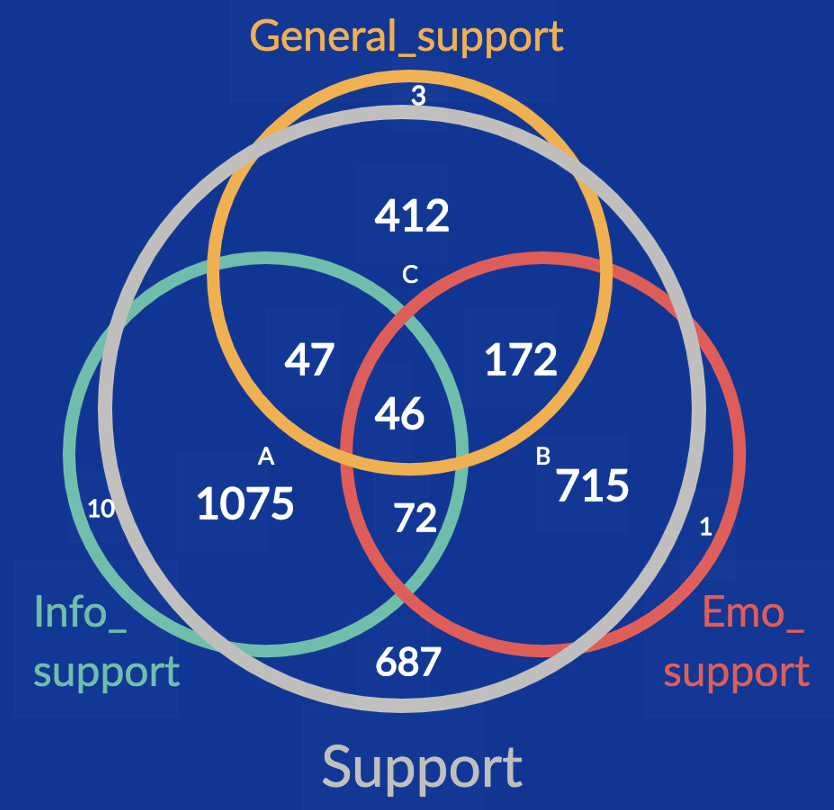
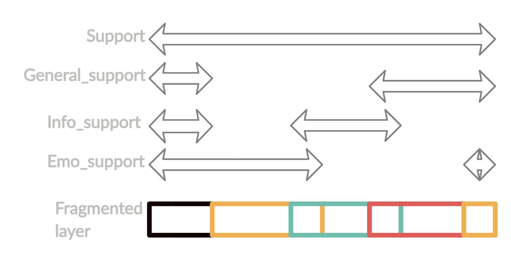
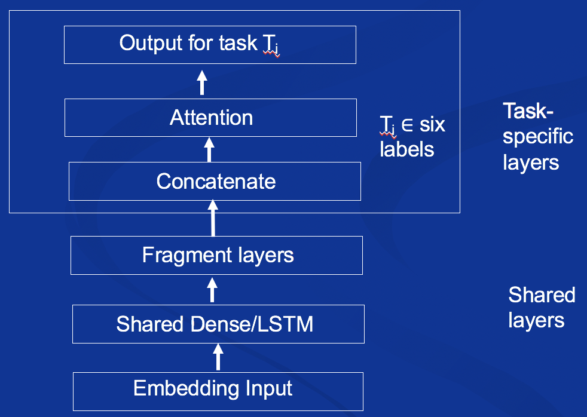

# claff-offmychest

> [CL-Aff Shared Task] Detecting Disclosure and Support via Deep Multi-Task Learning

We propose a novel way of deploying deep multi-task learning models for the task of detecting disclosure and support. We calculate all possible logical relations among six labels, represented in a Venn diagram. Based on it, the six labels are distributed to multiple fragment clusters. Then, a multi-task deep neural network is built on the groups.

## Task labels and description

- **Label group Disclosure**

1. ***Information_disclosure***: Comment contains personal information of author or people author mentioned

2. ***Emotion_disclosure***: Comment contains author’s positive or negative feelings 

  

- **Label group Supportiveness**

1. ***Support***: Comment offers support to someone

2. ***General_support***: Comment offers general support through quotes or catch phrases

3. ***Info_support***: Comment offers specific information, practical advice or suggesting a course of action

4. ***Emo_support***: Comment offers sympathy, caring or encouragement

## Data Preprocessing

#### Data Distribution

| **Label**                  | **True** | **False** |
| -------------------------- | -------- | --------- |
| **Emotion_disclosure**     | 3948     | 8912      |
| **Information_disclosure** | 4891     | 7969      |
| **Support**                | 3226     | 9634      |
| **General_support**        | 680      | 12180     |
| **Info_support**           | 1250     | 11610     |
| **Emo_support**            | 1006     | 11854     |

#### Venn graph (for group Supportiveness)

## Neural Network Model

### BERT embedding

Via bert-as-service. For the training data (12860 entries), two output shapes.

- Default:   (12860 × 1024)

- Elmo like: (12860 × 34 × 1024)

### Fragment layers based on the Venn graph

The bottom large dense layer is split into several parts (fragment layer). On top are territories of four labels: label-corresponding task-specific layers will only connect to their specific territories (neurons).

### Model Structure:

## Experiments and Results

Results for *Discolsure* and *Supportiveness* on 20% of the training data that we set aside for testing. Input data shape (12860 × 34 × 1024)

| **Label**                  | **accuracy** | **precision** | **recall** | **F1** |
| -------------------------- | ------------ | ------------- | ---------- | ------ |
| **Emotion_disclosure**     | 0.6847       | 0.4902        | 0.7133     | 0.5811 |
| **Information_disclosure** | 0.7012       | 0.6110        | 0.6215     | 0.6162 |
| **Support**                | 0.8233       | 0.6213        | 0.7436     | 0.6770 |
| **General_support**        | 0.9272       | 0.3023        | 0.2902     | 0.2961 |
| **Info_support**           | 0.8772       | 0.4177        | 0.6181     | 0.4986 |
| **Emo_support**            | 0.9284       | 0.4920        | 0.5151     | 0.5033 |
| **Macro scores**           | 0.8236       | 0.4890        | 0.5836     | 0.5287 |

## Conclusion

Multi-task learning with BERT embedding and fragment layers gets reasonable results on most of the labels. 
They are the worst on the label General_support due to the high imbalance.